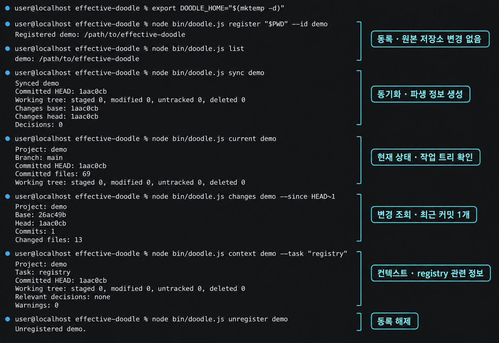

# effective-doodle

[한국어](README.ko.md) · English

effective-doodle v0.2 is a completed **local Project Knowledge Engine MVP** for Git repositories. It inspects source, configuration, documentation, and Git history to build reproducible derived knowledge. The Git repository remains the source of truth: registering it adds no files or dependencies and does not run its build or tests.

The MVP is a CLI and reusable Node.js API, not a hosted service or AI assistant. It does not use an external LLM, embeddings, a vector database, LangChain, LangGraph, MCP, or an orchestrator.

## Requirements and quick start

You need Node.js 20 or newer and Git. Run these commands **from the effective-doodle repository** to inspect this repository itself, without installing a global command:

```bash
npm ci
export DOODLE_HOME="$(mktemp -d)"

node bin/doodle.js register "$PWD" --id demo
node bin/doodle.js list
node bin/doodle.js sync demo
node bin/doodle.js current demo
node bin/doodle.js changes demo --since HEAD~1
node bin/doodle.js context demo --task "registry"
node bin/doodle.js unregister demo
```

This screenshot is an anonymized illustration. Paths are placeholders and commit IDs are shortened; the commands and explanations in this README are authoritative.



To inspect another Git repository, replace `"$PWD"` in `register` with its path. Keep `DOODLE_HOME` **outside** that repository. Alternatively, run `npm link` here and use `doodle` instead of `node bin/doodle.js`; nothing is installed in the repository being analyzed.

## Commands and output

| Command | Result |
| --- | --- |
| `register <repo> --id <id>` | Records one Git repository as one doodle project. |
| `list` | Lists registered projects. |
| `sync <id>` | Refreshes current facts, changes, and explicit Markdown decisions in derived storage. |
| `current <id>` | Shows committed branch/HEAD, committed file count, and working-tree state separately. |
| `changes <id>` | Reads the saved change snapshot; `--since <git-ref>` analyzes that ref without saving a new snapshot. |
| `context <id> --task <text>` | Builds deterministic, task-relevant context from available facts and decisions. |
| `unregister <id>` | Removes the registration and its derived project data, not the source repository. |

Every command accepts `--json` for machine-readable stdout; errors go to stderr with a nonzero exit code. Commands taking a project ID also accept `--id <id>` instead of the positional ID. `sync` accepts `--since <git-ref>` and `--rebuild`.

Run `sync` before `current`, default `changes`, or `context`. The **first** `sync` uses the current `HEAD` for both base and head, so its saved change set is empty. Later syncs compare against the last successful sync revision. In the quick start, `changes demo --since HEAD~1` separately shows the previous commit's changes; use another valid ref if the repository has no parent commit or is shallow. `sync --rebuild` regenerates derived snapshots and, without `--since`, resets the change baseline to the current `HEAD`. Existing snapshots are replaced atomically rather than deleted first.

`Relevant decisions: none` means no indexed decision matched the task; it is not an error. Working-tree counts depend on your current edits, so they may differ from the illustration. Task context gives precedence to machine-readable configuration, current source, explicit decisions, README/docs, and then derived knowledge. The engine reports observable repository facts and working-tree changes but does not infer unverified business meaning.

## Data, safety, and scope

```text
DOODLE_HOME/
  registry.json
  registry-transaction.json  # present only while a registry update needs recovery
  .registry.lock/             # temporary local cross-process lock
  projects/<id>/
    project.json       # source path and last successful sync revision
    current.json       # committed state, working tree, and detected facts
    changes.json       # last sync change snapshot
    decisions.json     # explicitly written Markdown decisions
```

By default, derived data lives under `~/.doodle`; `DOODLE_HOME` overrides that location. All persisted JSON has `schemaVersion: 1`. After registering the source repository again, its derived snapshots can be regenerated. Sensitive paths are excluded and recognized secret-like values are redacted from derived output, but this is **not a general secret scanner**: inspect any JSON or screenshot before publishing it.

`register`, `unregister`, `list`, and project lookup coordinate through one local lock per `DOODLE_HOME`. Concurrent updates wait up to five seconds, then fail clearly without changing the registry. If a process is killed, retry after the lock becomes stale (up to 30 seconds); subsequent operations recover interrupted registry work, and the next update finishes any pending cleanup. This is for processes on one machine and does not guarantee consistency on network filesystems or for concurrent `sync` and `unregister` operations.

`KnowledgeProvider` is the core application API exported from the package. The CLI only parses commands, calls this API, and formats its result:

```js
import { KnowledgeProvider } from 'effective-doodle';

const knowledge = new KnowledgeProvider();
knowledge.register('/path/to/git-repository', { id: 'sample' });
knowledge.sync('sample');
const context = knowledge.getContext('sample', 'authentication');
```

## Troubleshooting and verification

- `doodle: command not found`: use `node bin/doodle.js` from this repository, or run `npm link` here first.
- A missing `current.json` or `changes.json` error: run `sync <id>` before reading saved data.
- A storage-boundary error: move `DOODLE_HOME` outside the source repository.
- An invalid `HEAD~1` ref: use an existing ref such as `HEAD`, or a repository with at least two commits.
- A registry-lock timeout: another process is updating the same `DOODLE_HOME`; retry after it finishes. After a crash, allow up to 30 seconds for the stale lock to expire before retrying.

Run `npm test` for the Node.js unit/integration suite and the legacy shell suite. The MVP's real-repository smoke validation is recorded in [DEV-80](https://linear.app/kim015jh/issue/DEV-80).

## Legacy Wiki capability

The earlier Obsidian/Syncthing/Git/Quartz wiki scaffold remains in `scripts/`, `config/`, `vault/`, and `docs/operations/`. It is an independent legacy or experimental capability, not the Project Knowledge Engine's storage or execution path. Start with [server bootstrap](docs/operations/server-bootstrap.md); [project wiki mode](docs/operations/project-wiki-mode.md), [agent policy](docs/operations/llm-agent-policy.md), and the [verification checklist](docs/operations/verification-checklist.md) remain available.
